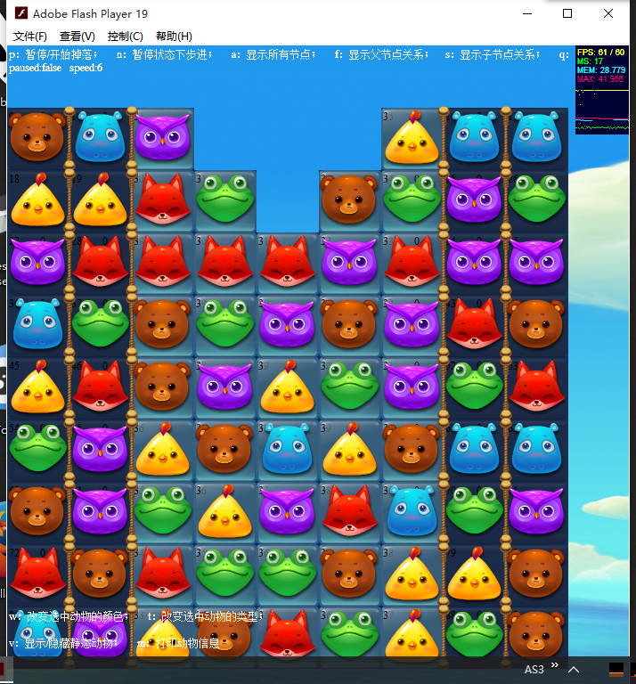
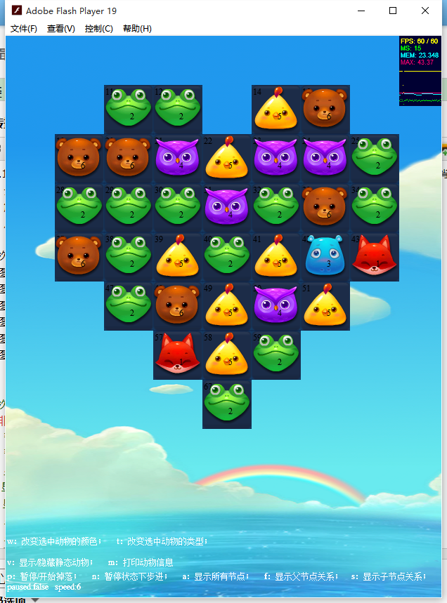
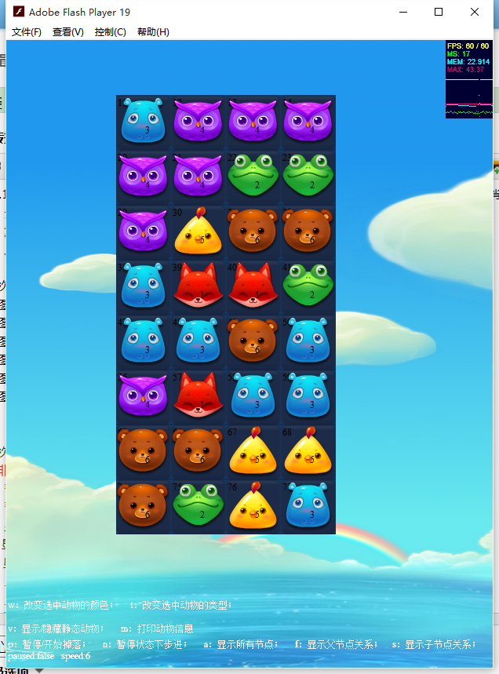
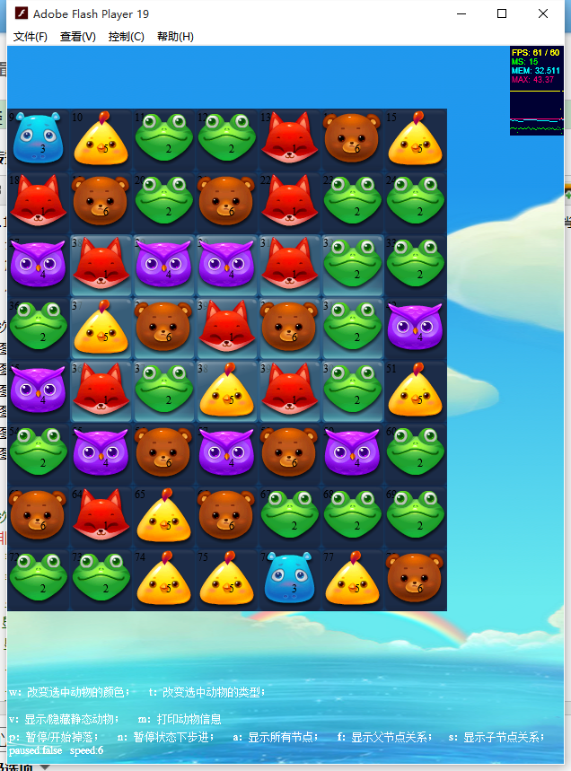
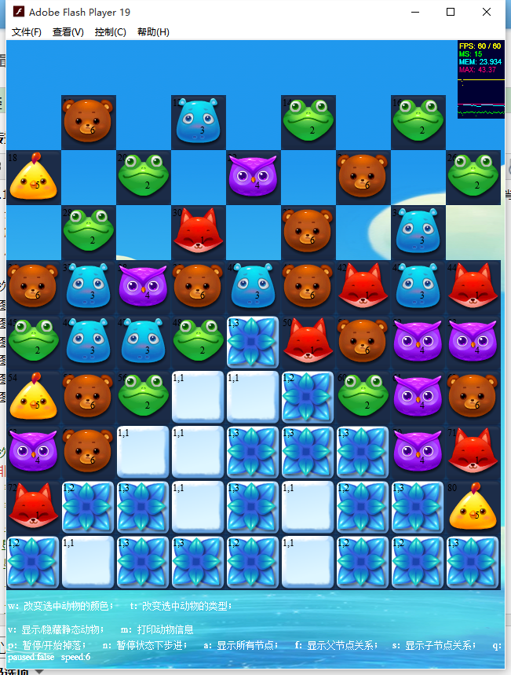
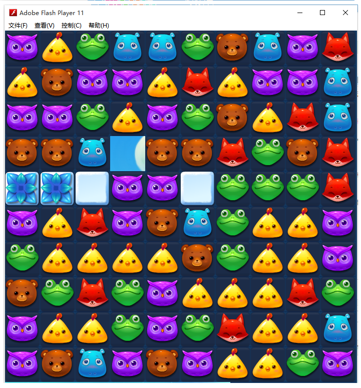
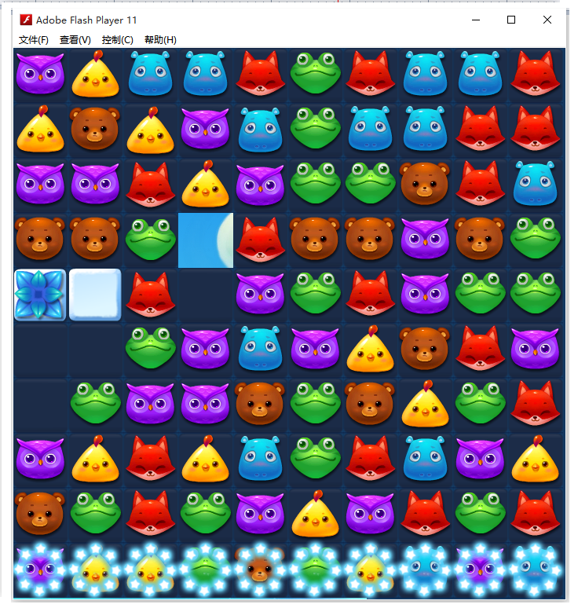

# 说明
虽然不多，但偶尔也有一些朋友对我13年写的这个程序有兴趣，此前断断续续放在了不同的服务器上，随着技术变革，flash不但早已不是当年火爆网页的插件，而且已经RIP，就让这份当年对程序的热爱也一起RIP吧。不过我有想法改写成纯JS版本的，看以后的情况吧。

这段文字以下的内容是当年写在博客中的log，最近整理日志翻到了它，想着这里应该才是其最佳的地方吧。

----

*这是款完全模仿火爆手游《开心消消乐》的网页游戏，用AS3开发。前期版本计划定期更新（每周日晚上更新），程序与资源已提交Github（见下），感兴趣的朋友可以fork。我只知道：技能需要磨练，不停的磨练。*

## Github addr

https://github.com/zspark/lsx

## V2.0

按照原计划这次发布的应该是v1.3版本（大概内容见v1.2章节），但在开发过程中一来动物重叠的bug时常骚扰我，二来严重影响游戏体验，故此打算先花时间来修复这个bug。bug查找过程花了好长时间，因为其概率性出现，并且需要较大的基数。这次bug修复将开发版本整体提升到v2.0阶段。具体变化内容如下：

* `master`分支更新;
* 地图（棋盘）居中；（未居中的地图是因为之前调试地图数据未从第一列开始，可无视）；
* 删除了界面中按键说明的debug信息，与v1.1版本快捷键有少量出入，调试按键如下（粗体为变动或添加快捷键,在非汉语输入法的情况下按键）：

	* p：暂停/开始自动掉落；
	* n：暂停状态下步进；
	* a：显示所有节点；
	* f：显示父节点关系；
	* s：显示子节点关系；
	* **e：显示供给节点关系；**
	* q：显示特殊节点；
	* g：显示掉落网格；
	* c：清除调试绘制图像;
	* -：减速；
	* +：加速；
	* v：显示/隐藏静态动物；
	* m：打印动物信息（游戏界面不可见）；
	* w：改变选中动物的颜色；
	* t：改变选中动物的类型；
	* **->（左方向键）：下一关；**
	* **<-（右方向键）：上一关；**

### demo addr

复制到浏览器打开，不然直接下载，v2.0版本：

> {{site.url}}{{page.subSwfPath}}v2_0/lsx_v2_0.swf

注意点击屏幕，或者尝试刷新；资源异步加载，视当时网络状态而定。

### v2.1预计内容（原v1.3内容）：

- 毒液（暂无章鱼）；
- 初级毛球（任何消除都能干掉的毛球）；
- 初始动物天然不构成三消关系；

## V1.2

v1.2版本来了，新增内容如前说述：

* 篱笆墙；
* 掉落速度问题；
* 整理程序，提交GitHub（见下）；

需要说明的是，游戏暂时改名为《乐三消》（lsx），因为老是说《开心消消乐》会让大家有所误解。
这次版本除了以上3点外，继续对既有程序进行深度整合，这是我的编程风格，因为随着系统的复杂度提升，若是没有较之前更加合理，明确，健壮的模块（或者子系统）支持的话，整个游戏在程序开发过程中其困难度会成指数级增加。
这次版本在我测试的过程中存在以下问题：由于动物在被消除后会有200到300ms的延迟掉落时间，以至于在触发直线与魔力鸟的组合消除时，这种延迟更容易导致动物之间的重叠。这个问题我会在未来某个版本修复，因为目前尚未最佳的解决思路；

### demo addr

复制到浏览器打开，不然直接下载，v1.2版本：

> {{site.url}}{{page.subSwfPath}}v1_2/lsx_v1_2.swf

注意点击屏幕，或者尝试刷新；资源异步加载，视当时网络状态而定。

## v1.2

### v1.3预计内容

* 毒液（暂无章鱼）；
* 初级毛球（任何消除都能干掉的毛球）；
* 初始动物天然不构成三消关系；

## V1.1

v1.1版本来了，这次在v1的版本上主要优化了核心玩法的体验，尽可能的接近《开心消消乐》的感觉，同时新增以下功能：

- 全部组合消除功能；
-  解决了动物掉落时由于次序问题引起的重叠现象；
-  从三个子系统中再次抽象出共同接口与通用方法，优化程序实现；

此次版本地图用于以下测试（地图形状与编号来自《开心消消乐》）：

* 地图1（心形地图）：用于测试不规则的地形；
* 地图2（4列8行地图）：用于测试传送功能；
* 地图3,4：用于测试组合连消；
* 地图5：用于测试组合连消与传送；
* 地图8：用于测试玻璃（或者叫气泡？）；
* 地图33：用于测试雪块；

这次发布了调试版本，大家可以注意查看游戏下方的调试说明，或者阅读下面按键说明，注意在非汉语输入法的情况下按键：

* p：暂停/开始自动掉落；
* n：暂停状态下步进；
* a：显示所有节点；
* f：显示父节点关系；
* s：显示子节点关系；
* q：显示特殊节点
* g：显示掉落网格；
* c：清除调试绘制图像;
* -：减速；
* +：加速；
* v：显示/隐藏静态动物；
* m：打印动物信息；
* w：改变选中动物的颜色；
* t：改变选中动物的类型；
* .（句号）：下一关；
* ，逗号）：上一关；

### demo addr

复制到浏览器打开，不然直接下载，v1.1版本：

> {{site.url}}{{page.subSwfPath}}v1_1/kxxxl_v1_1.swf

注意点击屏幕，或者尝试刷新；资源异步加载，视当时网络状态而定。

## v1.1

### v1.2预计内容

* 篱笆墙；
* 掉落速度问题；
* 整理程序，提交GitHub；（程序复杂度逐渐增加，一来需要版控，二来希望有新朋友参与；）

## V1.0
v1.0版本，目前还有部分bug，不太影响游戏。程序结构上初步实现《开心消消乐》核心玩法，对后期诸如传送带等也已有开发思路。程序、开发思路目前还在整理中，稍后共享GitHub。v1.0版本实现功能有：

* 核心掉落功能；（可能与《开心消消乐》部分情况不太一样，我也不愿去强迫自己非要与其一模一样）；
* 消除功能；
	* 雪、冰等障碍物的消除；
	* 普通、特效动物的消除；（组合消除目前没有实现魔力鸟与直线、爆炸特效鸟的组合）；
* 特效、音效的部分表现；

### demo addr

复制到浏览器打开，不然直接下载，v1.1版本：

> {{page.subSwfPath}}v1_0/kxxxl_v1_0.swf }}

注意点击屏幕，或者尝试刷新；资源异步加载，视当时网络状态而定。

## v1.0

### v1.1预计内容

* 全部组合消除；
* 修复bug；
* 明确子系统的接口功能；

